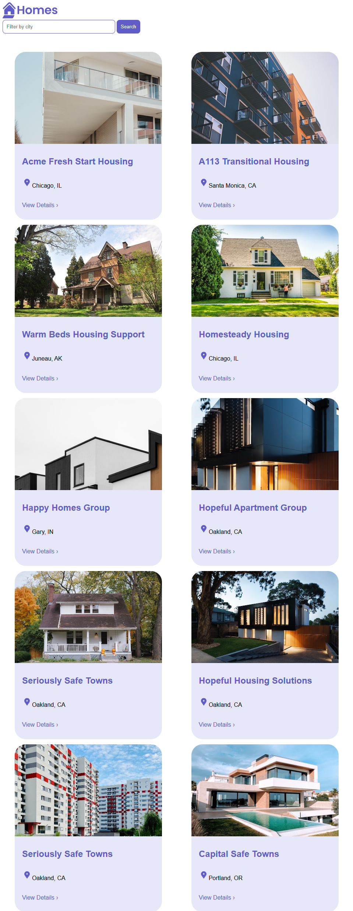
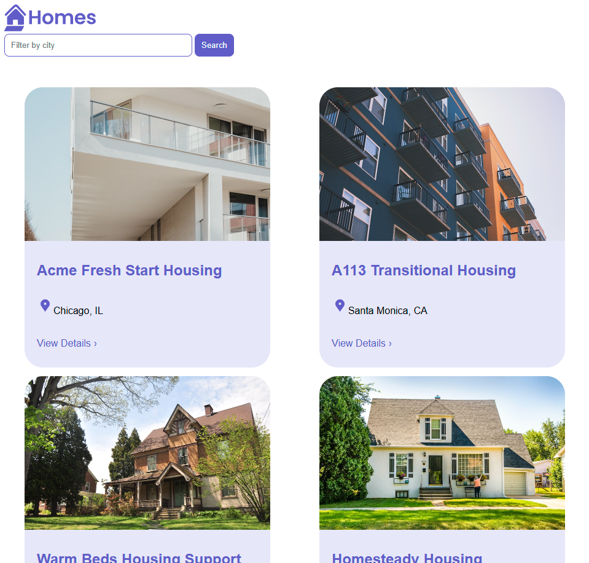
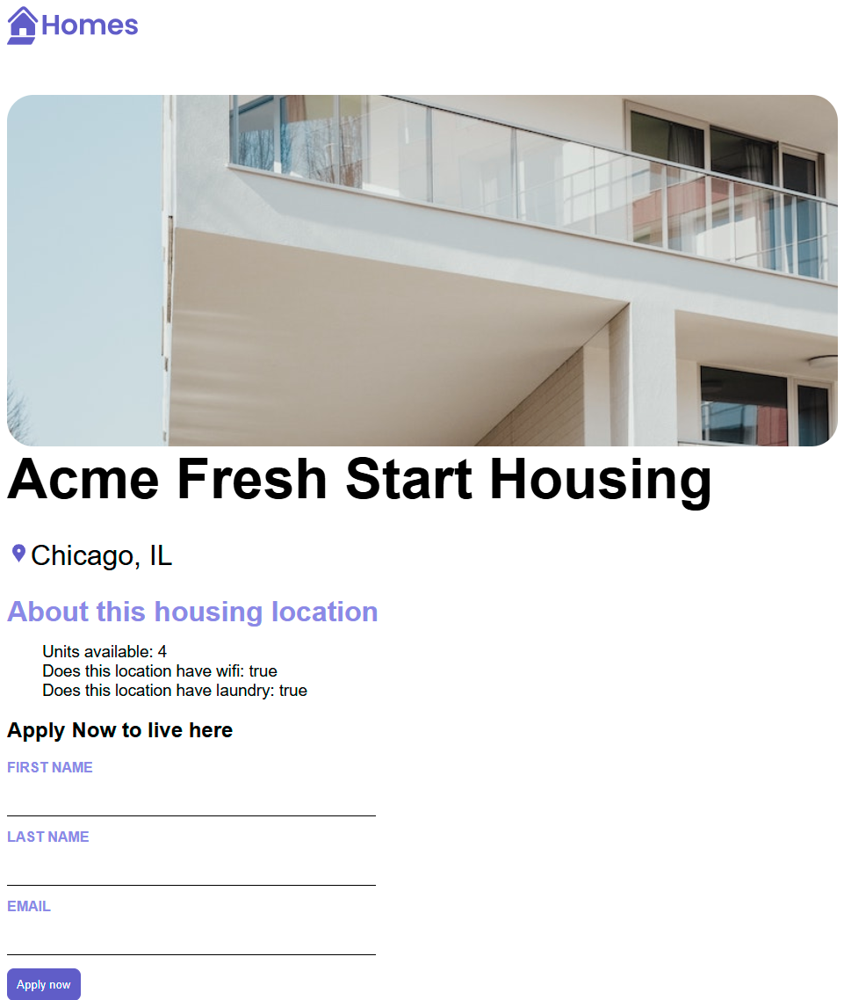

# AppTutorial

Este proyecto fue creado como parte de mi proceso de aprendizaje de Angular, siguiendo el tutorial oficial de su documentación. Aquí pongo en práctica conceptos esenciales como componentes, directivas, servicios, inyección de dependencias, formularios y más. Proyecto realizado con Angular 19.

## Probar con servidor de desarrollo

Para iniciar un servidor de desarrollo local, ejecuta el siguiente comando:

```bash
ng serve
```

Una vez en ejecución, abre tu navegador y navega a http://localhost:4200/. La aplicación se recargará automáticamente cada vez que realices cambios en los archivos fuente.

## Estructura y funcionalidades del proyecto

Este proyecto incluye:

· Creación y uso de componentes

· Aplicación de directivas estructurales y de atributos

· Uso de servicios e inyección de dependencias

· Implementación de formularios reactivos y basados en plantillas

· Comunicación entre componentes (Input, Output)

## Capturas de Pantalla






## Despliegue

Para compilar el proyecto y generar los archivos listos para producción, ejecuta:

```bash
ng build
```

Los archivos se guardarán en el directorio dist/ y estarán optimizados para mejor rendimiento.

## Recursos adicionales

Para más información sobre Angular CLI y sus comandos, visita la documentación oficial.

## Desarrollado por

👩‍💻 Alexandra Ferrera  
📚 En proceso de aprendizaje continuo sobre Angular y desarrollo frontend  
🎨 Portfolio: [Alexandra Ferrera Desarrolladora Frontend & UX/UI](https://alexandra-ferrera-portfolio.netlify.app/)
